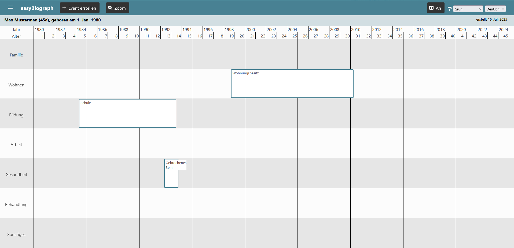
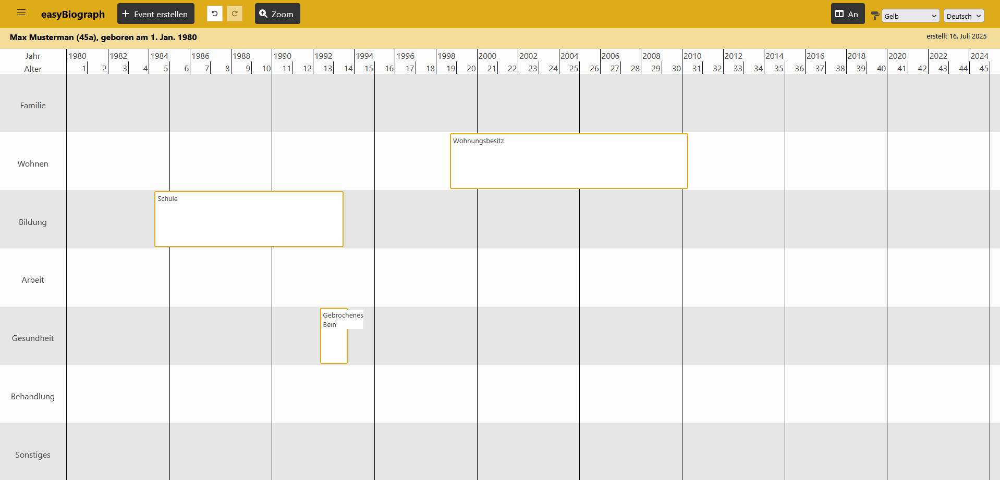
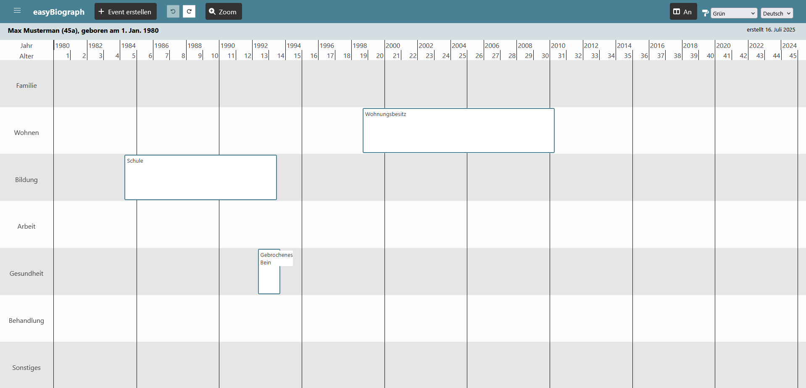

## Einleitung

Der easyBiograph ist ein FH Projekt, welches original durch das EU-Programm Erasmus+ entstanden ist und davon gefördert wurde. Mithilfe des easyBiograph kann man die Familien-, Wohn-, Bildungs-, Arbeits-, Gesundheits- und Hilfe-Biografien einer Person entlang einer Zeitachse notieren und diese dann analysieren.

Ich habe im Laufe der FH-Lehrveranstaltung "Tun-Forsche-Gründen" an diesem Projekt mitgearbeitet. Ziel der Lehrveranstaltung war es, dass andere StudentInnen oder auch Forschungsprojekte ein Arbeitspaket von ca. 80 Stunden ausschreiben konnten, und man sich dann für eines von diesen beworben hat. Ich habe mich hier eben für das Forschungsprojekt "easyBiograph" beworben. Dipl.-Ing. Mag. Alexander Rind hat mir dann verschiedene Arbeitspakete zum Aussuchen gegeben, im easyBiograph, wie auch im Projekt easyNWK, ein weiteres Projekt, für welches er Arbeitspakete ausgeschrieben hat.

Hierbei habe ich mich dann dafür entschieden, eine undo Funktion einzubauen. Ziel der Funktion war es, dass man die einzelnen Arbeitsschritte, welche man bei der Verwendung des Biografen benutzt, wieder rückgängig machen kann und sie aber gleichzeitig auch wiederherstellen kann. Die Verwendung sollte hierbei auch den normalen Erwartungen einer Person entsprechen, zum Beispiel so wie man es von Microsoft Word gewöhnt ist.
## Umsetzung

Der easyBiograph hatte schon umfassende Funktionen, als ich bei diesem Projekt eingestiegen bin und mitgearbeitet habe. Man kann einen Biografen für eine Person erstellen und auf verschiedenen Eventachsen, welche man auch selbst erstellen kann, die Events eintragen. Auch kann man hineinzoomen und verschiedene Einstellungen treffen. Zum Beispiel das Farbschema der Oberfläche ändern oder zwischen Deutsch und Englisch umschalten. Der Biograf kann auch ausgedruckt werden.

Der easyBiograph ist in Vue.js geschrieben und die undo Historie speziell verwendet den sogenannten Vuex Store. Dies ist eine Vue.js Library für State Management. Hierbei musste ich nicht von Grund auf ein undo und redo System entwickeln, sondern es gab schon eines im Forschungsprojekt easyNWK, an welchem ich mich orientieren konnte. Auch ein grundsätzliche System für die undo Historie gab es schon im easyBiograph, welches sich anhand dieser Repositories (https://github.com/anthonygore/vuex-undo-redo und https://easynwk.fhstp.ac.at/) orientiert hat. Grundsätzlich wird jede State Änderung (zum Beispiel ein neues Event, Änderungen der Einstellungen, ...) als Translation ausgeführt und als Liste gespeichert, um anhand dieser Liste die Aktion wieder rückgängig zu machen oder wiederherzustellen. 

Ich habe mich einmal damit beschäftigt, dass grundsätzliche System mit dem Rest des Biografen zu verbinden und zu schauen, wie gut es schon einmal funktioniert. Neue Knöpfe fürs Rückgängig machen und Wiederherstellen wurden eingefügt und das undo System damit verbunden. Hiermit konnte man schon einmal einfache Aktionen, wie zum Beispiel Event Erstellung, rückgängig machen. Dabei sind mir aber verschiedene Probleme aufgefallen.

Zum Beispiel wurden die Einstellungen, wie die Sprache oder das Farbschema, nicht richtig abgespeichert, wodurch sie nicht von Vuex erkannt wurden. Auch ergab sich ein größeres Problem: Manche Aktionen, wie das Zoomen in den Biografen oder das Ändern der Biograf-Einstellungen (Personendetails, Biograf Achsen) müssen den Biografen neu laden. Dies sorgt aber dafür, dass die Transaktionsliste gelöscht wird und es keinen Zugriff mehr auf die undo Historie gibt. 

Hierbei musste ich mir etwas einfallen lassen, wodurch ich trotzdem noch die Transaktionsliste nach einem neu laden des Browsers habe. Hierbei habe ich den localStorage verwendet, eine Möglichkeit des Browsers um Werte zu speichern und auch nach einem neu laden noch Zugriff auf diese zuhaben. 

Sobald eine dieser Aktionen ausgeführt wurde, habe ich die Transaktionsliste in den localStorage gespeichert und nach dem Laden sofort wieder herausgeholt, damit alle Transaktionen erhalten bleiben. Dies passiert aber nur bei diesen speziellen Einstellungsänderungen und nicht, wenn man die Seite normal verlassen würde, da die normale Erwartungshaltung ist, dass die undo Historie so lange erhalten bleibt, wie man arbeitet.

Sobald ich alles fertig hatte und getestet habe, habe ich eine merge Request im Repository erstellt, damit sich Dipl.-Ing. Mag. Alexander Rind meine Änderung auch anschauen und überprüfen konnte. Nachdem ich noch ein paar von ihm gewünschte Änderungen vorgenommen hatte, war er sehr zufrieden mit meinen Änderungen und hat diese abgenommen.
## Fazit

Es ist immer eine Herausforderung, in ein bestehendes Projekt einzusteigen und in diesem Änderungen vorzunehmen. Genauso ist es aber auch immer ein tolles Gefühl, das Projekt langsam aber sicher zu verstehen und dieses weiterzuentwickeln. Ich bin sehr froh, dass ich am easyBiograph mitentwickeln konnte und dass meine Arbeit sehr zufriedenstellend war.
## Links

- easyBiograph GitHub-Repository: [https://github.com/fhstp/easybiograph](https://github.com/fhstp/easybiograph)
- easyBiograph Informationsseite: [https://easybiograph.fhstp.ac.at/](https://easybiograph.fhstp.ac.at/)
- easyNWK GitHub-Repository: [https://github.com/fhstp/easynwk-web](https://github.com/fhstp/easynwk-web)
- easyNWK Informationsseite: [https://easynwk.fhstp.ac.at/](https://easynwk.fhstp.ac.at/)
- Vue.js: [https://vuejs.org/](https://vuejs.org/)
- Vuex: [https://vuex.vuejs.org/](https://vuex.vuejs.org/)
- Inpirationsrepository: [https://github.com/factorial-io/undo-redo-vuex](https://github.com/factorial-io/undo-redo-vuex)
- Inpirationsrepository: [https://github.com/anthonygore/vuex-undo-redo](https://github.com/anthonygore/vuex-undo-redo)