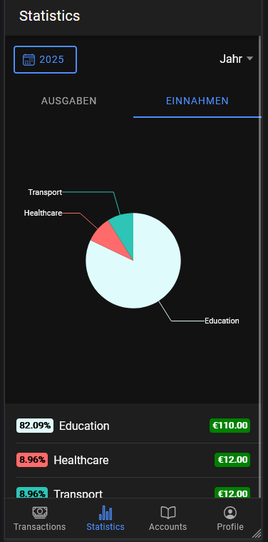

## Meine Projetkte

Auch im zweiten Semester ist es Teil der Aufgaben in der Mobile Masterklasse, dass man ein eigenes Semesterprojekt programmiert. Ich war sehr daran interessiert, mein digitales Haushaltsbuch, welches in Ionic + Angular geschrieben wurde, aus dem letzten Semester weiterzuführen. Dabei wollte ich die grundsätzlichen Funktionen etwas verbessern und neue hinzuzufügen. Grundsätzlich wollte ich meinen Code refactoren, um Verbesserungen der Dozenten einzubauen, aber auch ihn selbst zu verbessern. Weiters wollte ich meine Userfunktionen erweitern, das sich neue User registrieren können und das Accounts und Transaktionen nur User bezogen sind. Zuletzt wollte ich auch Graphen einbauen, um die Ausgaben und Eingaben grafisch darzustellen.
## Features

### Registrierung

Es war schon davor möglich, sich einzuloggen. Dies war aber nur über einen schon vordefinierten Testaccount möglich. Nun gibt es die Möglichkeit, auch neue User anzulegen. Diese neue Seite kann man leicht von der Loginseite erreichen und auch wieder zur Loginseite zurückkehren. 

Wie beim Login kommt man bei der erfolgreichen Registrierung auf die Transaktionssicht. Jeder User bekommt am Anfang auch standardmäßig ein Konto namens "Bankkonto", damit sie gleich mit dem Transaktions einfügen starten können. Auch habe ich die Profilseite etwas schöner gemacht. Es gibt ein Default User Image und man sieht die E-Mail des eingeloggten Users.

| ![[Pasted image 20250611220932.png]] | ![[Pasted image 20250611220950.png]] |
| ------------------------------------ | ------------------------------------ |
### Grafenansicht

In der Tabbar unten gibt es jetzt einen neuen Tab namens "Statsitics". Über diesen kommt man dann auf die Grafikansicht. In dieser Ansicht kann man grundsätzlich einmal zwischen den Einnahmen und Ausgaben wechseln. Auch kann man den Zeitraum angeben. Entweder kann man ein Monat eines Jahres auswählen. Man kann aber auch zur Jahresansicht über ein Dropdown wechseln, wo man dann alle Transaktionen des ausgewählten Jahres sieht.

In der eigentlichen Grafikansicht werden Kreisdiagramme verwendet. Diese zeigen die Anteile der Ausgaben/Eingaben einer bestimmten Kategorie in diesem Monat/Jahr. Beim hovern kann man auch den genauen Betrag dieser Kategorie sehen. Zusätzlich gibt es unten eine Listenansicht mit den Kategorien und Beträgen, welche zusätzlich anhand der Prozentanteile im Kreisdiagramm geordnet sind

| ![[Pasted image 20250611220834.png]] | ![[Pasted image 20250611220844.png]] |  |
| ------------------------------------ | ------------------------------------ | ------------------------------------ |

## Technologien

Im Frontend verwende ich weiterhin Ionic in Verbindung mit Angular und im Backend NestJS. Aber es sind manche Technologien hinzugekommene. Im Backend habe ich meine Swagger Dokumentation ausgebaut, welche zwar schon im Projekt enthalten war, aber noch nicht richtig verwendet wurde. Swagger dient dazu, REST Endpunkte zu dokumentieren. Dies habe ich gemacht, da ich im Frontend OpenAPI verwenden wollte. OpenAPI generiert automatisch die nötigen Klassen aus der Swagger Dokumentation, um im Frontend mit den gleichen Klassen und Methoden wie im Backend arbeiten zu können. Bevor OpenAPI musste ich für alle Entities im Backend auch Klassen im Frontend erstellen, zusammen mit dem manuellem aufrufen der Routen.

Mit OpenAPI kann ich nun über die generieren Service Klassen, einfach Methoden verwenden, welche die Route aufrufen und alles selbst abhandeln und zusammen mit den nötigen Modellen. Zusätzlich habe ich das package "Ngx-charts" verwendet, welches es mir ermöglicht, interaktive Diagramme in Ionic erstellen zu können.
## Herausforderungen

Die Verwendung von Ionic und NestJS war bei diesem Projekt jetzt schon weniger eine Herausforderung als beim letzten. Zusätzlich haben wir zu Beginn des Semesters in der Wild Week ein Projekt mit NestJS und Ionic + React gemacht, wo ich auch auf Wissen von diesem Zurückgreifen konnte.

Die größte Herausforderung war wahrscheinlich die Graphen Bibliothek, "ngx-charts". Hier war nämlich das Problem, dass die Dokumentation nicht wirklich gut war. Man sieht zwar, welche Graphen es gibt und welche Einstellungen man bei diesen Treffen kann, aber in der Doku gibt es nicht wirklich Beispielcode oder Beispiele, was sich die Methoden erwarten. Auch hat die Dokumentation nicht komplett gestimmt. Zum Beispiel wurde beim Kreisdiagramm in der Dokumentation ein Attribut erwähnt, welches das echte überhaupt nicht besessen hat.

Dies hat es manchmal schwer gemacht, die Graphen wirklich gut zu verwenden. Aber es gab eine gute Sache, nämlich das es eine Demo Seite gibt, wo man sich zumindest anschauen konnte, wie die ganzen verschiedenen Graphen aussehen und diese auch selbst anpassen konnte, über bereitgestellte Checkboxen und Inputs. Leider waren dies aber auch nicht komplett hilfreich bei der konkreten Implementierung.

## Learnings und Nächste Schritte

Zum einen habe ich gelernt, wie man OpenAPI mit NestJS und Ionic + Angular verwendet. Hierbei konnte ich glücklicherweise auf einen Blogeintrag meines Studienkollegen Jan Weiß zurückgreifen, welcher sehr geholfen hat. Wenn in NestJS alles dokumentiert ist, ist es sehr leicht im Frontend zu beginnen, die Klassen einfach zu verwenden. 

Auch weiß ich nun, wie man Grafikansichten in Ionic Angular einbauen kann. Zwar kann es andere Grafen Bibliotheken geben, mit anderer Funktionsweise, ich weiß aber jetzt, wie diese unter Umstände grundsätzlich zu verwenden sind.


asdasd
```bash
npm run serve
```

```python
def hello_world():
    print("Hello, Obsidian-style!")
```


npm run serve


<section class="hero">
            <div id="content">
            <p>Immer zuerst bei Kryptowährung alles nachschauen. Auf social media schauen ob sie aktiv sind. In das WHitepaper schauen, was die ganue machen oder weahlbs sie existiert.<br />
Auch durch einen Blockeditior in den bblöcke der Blockchain schaune, da auch wenn sie soacial media aktiv sind, sich tzropzdem in echt nichts tun kann.</p>
<pre><code>npm list # zum anzeigen von npm paktene


npm install crypto-js</code></pre></div>


<div class="highlight"><pre class="highlight"><code><span class="k">def</span> <span class="nf">hello_world</span>():  
  <span class="nb">print</span>(<span class="s">"Hello, Obsidian-style!"</span>)
</code></pre></div>
</section>
