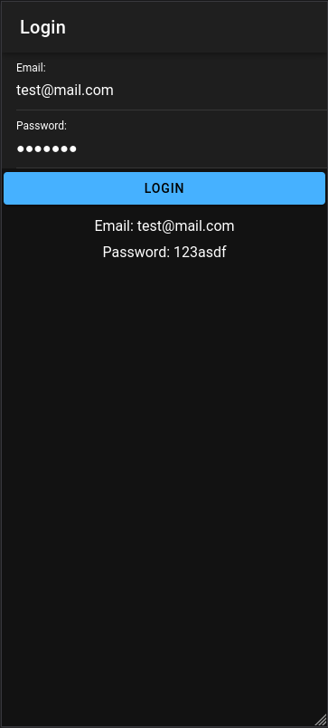
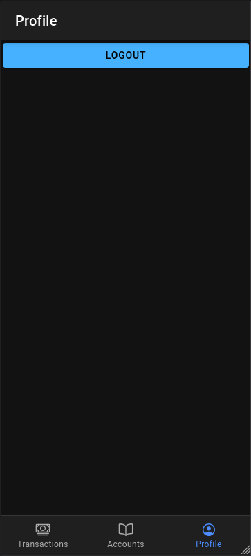
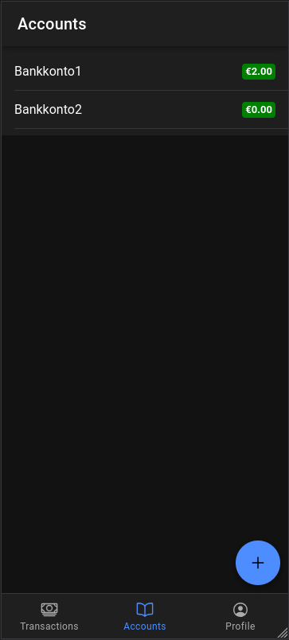
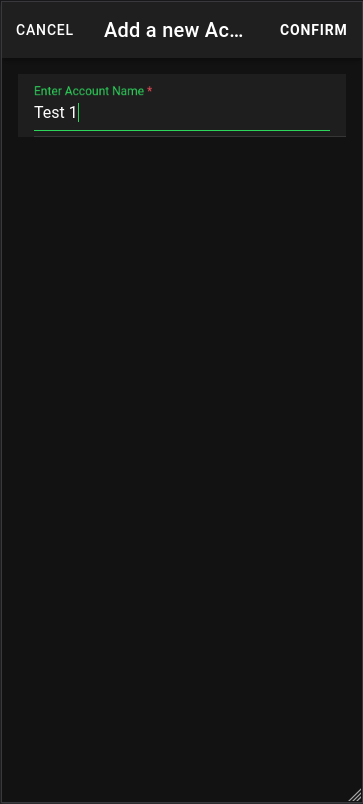
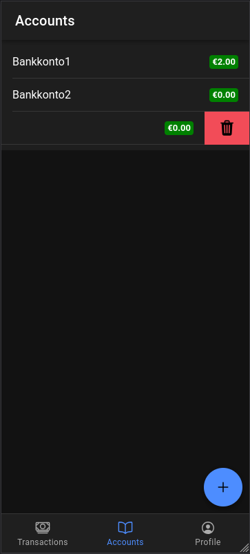
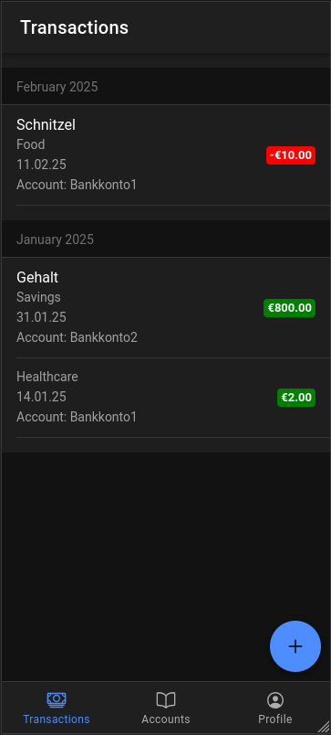
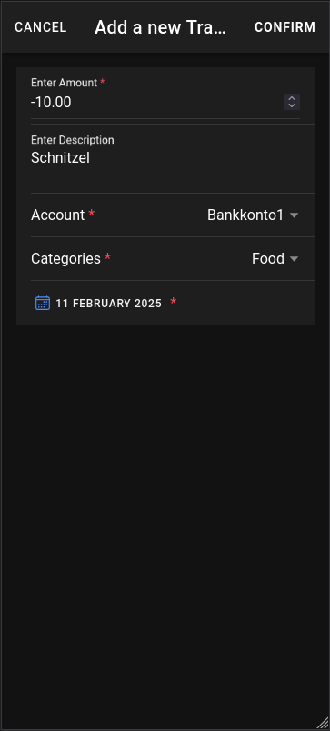
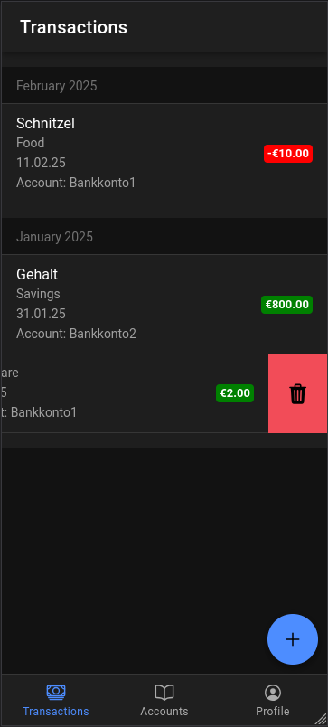
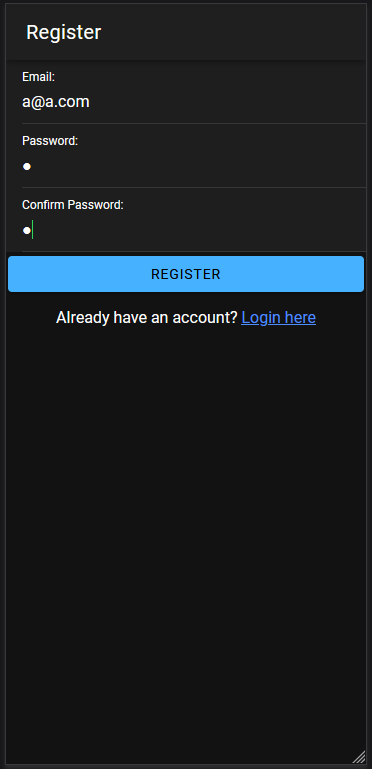
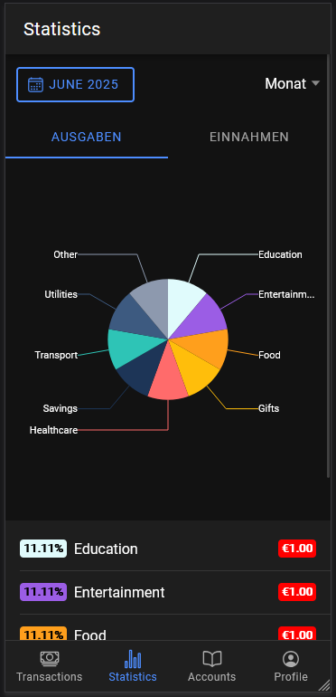

## Erstes Semester

Teil des ersten Semesters in der Mobile Masterklasse war es das Ziel, ein eigenes Projekt zu programmieren, welches man selbst definieren durfte. In letzter Zeit hatte ich mich vertrauter mit Finanzen gemacht und habe mich deshalb wegen digitalen Haushaltsbüchern umgeschaut. Nach ein wenig suchen fand ich aber keines, welche leicht das Eintragen auf Mobile wie auch am Desktop ermöglichte. Nachdem wir im Unterricht die Multiplattform Sprache [[21.11 Ionic|Ionic]] gelernt haben, hatte sich hier die Möglichkeit angeboten, selbst ein Haushaltsbuch zu erstellen. Nachdem das Erstellen eines Haushaltsbuchs eine größere Angelegenheit ist, war für zuerst einmal der Fokus, Basisfunktionen, wie das Erstellen von Konten und das Durchführen von Transaktionen auf diesen Konten, zu implementieren.
### Features

Wie gesagt habe ich mich in diesem Projekt erst einmal auf die Hauptfunktionen fokussiert:
#### Anmeldung

Es gibt ein einfaches Anmeldeformular, welches unbefugte User vom Einsehen der Daten stoppt. Wenn man nicht eingeloggt ist, kann man weder das Backend bedienen, noch kann man im Frontend auf andere Seite navigieren, außer der Login Seite. Bisher gibt es nur einen vor angelegten User, welcher Zugriff auf alles hat. Hier gibt es aber Pläne, die Funktionen auszubauen.

Wenn man eingeloggt ist, gibt es dann auf der Hauptseite eine Tab-Bar mit einer Profilseite, wo man sich bisher einfach wieder ausloggen kann.

|  |  |
| ------------------------------------ | ------------------------------------ |
#### Kontenansicht

Der zweite Tab auf der Tab-Bar ist für die Konten, auf welche man die Transaktionen gibt. Jedes Konto hat einfach einen Namen, und sie werden dem Namen nach geordnet. Auch kann man den Gesamtbetrag aller Transaktionen auf diesem Konto einsehen.

Wie auch auf der Transaktionsseite gibt es hier die Möglichkeit neue Konten hinzuzufügen, durch auf sie draufdrücken zu editieren und durch nach links ziehen zu löschen. Wenn man ein Konto löscht, werden auch alle Transaktionen auf diesem Konto gelöscht. 

|  |  |  |
| ------------------------------------ | ------------------------------------ | ------------------------------------ |

#### Transaktionsansicht

Wenn man eingeloggt ist und man sich auf der Hauptseite nun befinden, sieht man unten drei Tabs. Zuerst wird man auf der Transaktionsseite erscheinen. Hier sieht man alle Transaktionen, nach Datum aufgelistet und nach Monat gruppiert. 

Man kann bei den Transaktionen erkennen, ob Geld abgehoben oder eingezahlt wurde und weiterführen Informationen, wie welches Konto für die Transaktion verwendet wurde und an welchem Datum sie durchgeführt wurde. Auch kann man eine optionale Beschreibung vergeben und man kann die Kategorie der Transaktion sehen. Die Transaktionen sind vorgefertigte Einträge in der Datenbank, welche man zum Einorden der Transaktionen verwenden kann.

Auf dieser Seite kann man auch neue Transaktionen mit dem Floating Button hinzufügen. Beim Klicken auf eine Transaktion diese editieren oder durch das nach links ziehen einer Transaktion diese auch löschen.

|  |  |  |
| ------------------------------------ | ------------------------------------ | ------------------------------------ |

### Technologien

Für das Frontend habe ich Ionic in Verbindung mit Angular verwendet. Im Backend habe ich NestJS verwendet. Weiters habe ich für das Backend auch verschiedene Libraries, wie TypeOrm für das Objekt und Relation Mapping, class-validator für Validieren der Requests und Responses oder bcrypt zum Verschlüsseln der Passwörter verwende. 

Die Anmeldung funktioniert über einen JWT, welcher im Backend generiert wird und ans Frontend geschickt wird. Zum einen sind die Routen im Backend gesichert, aber auch im Frontend sind bestimmte Seiten nur mit gültigem JWT erreichbar.
### Herausforderungen

Ich war schon in meinem Bachelor Studium mit Ionic bekannt geworden und habe auch ein Semesterprojekt in diesem abgeschlossen. Daher war mir die Verwendung schon etwas bekannt. Aber mit NestJS hatte ich noch keinen Kontakt, vor allem nicht mit dem Objekt Relation Mapping. Vor allem auch nicht die Verbindung zwischen Ionic und NestJS. 

Hier hat das Übungsprojekt, welches wir im Unterricht gemacht habe, sehr geholfen. Ich wusste, wie der generelle Aufbau sein sollte und wie man richtig beginnt. Dadurch konnte ich mir Stück für Stück auch selbst das Wissen aneigne und mein NestJS Backend erstellen und dieses mit meinem Ionic Frontend verbinden.
### Learnings und Nächste Schritte

Ich konnte einiges aus diesem Projekt lernen, vor allem in der Verwendung von NestJS. Aber auch in der Verwendung von Ionic. Da das Semesterprojekt im Team gemacht wurde, ist es natürlich vorgenommen, dass manche Teile von Ionic weniger behandelt wurden. Aber jetzt, nach diesem Projekt habe ich das Gefühl, um einiges standfester mit Ionic und NestJS zu sein.

In den nächsten Semestern würde ich dieses Projekt auch gerne weiterführend, größtenteils für mich selbst. Ich würde gerne das System weiter ausbauen, zum Beispiel mit einer Grafikansicht der Ausgaben und Einnahmen oder einem System, welches verscheiden Abonnements tracken kann.

## Zweites Semester

Auch im zweiten Semester ist es Teil der Aufgaben in der Mobile Masterklasse, dass man ein eigenes Semesterprojekt programmiert. Ich war sehr daran interessiert, mein digitales Haushaltsbuch, welches in Ionic + Angular geschrieben wurde, aus dem letzten Semester weiterzuführen. Dabei wollte ich die grundsätzlichen Funktionen etwas verbessern und neue hinzuzufügen. Grundsätzlich wollte ich meinen Code refactoren, um Verbesserungen der Dozenten einzubauen, aber auch ihn selbst zu verbessern. Weiters wollte ich meine Userfunktionen erweitern, das sich neue User registrieren können und das Accounts und Transaktionen nur User bezogen sind. Zuletzt wollte ich auch Graphen einbauen, um die Ausgaben und Eingaben grafisch darzustellen.
### Features

#### Registrierung

Es war schon davor möglich, sich einzuloggen. Dies war aber nur über einen schon vordefinierten Testaccount möglich. Nun gibt es die Möglichkeit, auch neue User anzulegen. Diese neue Seite kann man leicht von der Loginseite erreichen und auch wieder zur Loginseite zurückkehren. 

Wie beim Login kommt man bei der erfolgreichen Registrierung auf die Transaktionssicht. Jeder User bekommt am Anfang auch standardmäßig ein Konto namens "Bankkonto", damit sie gleich mit dem Transaktions einfügen starten können. Auch habe ich die Profilseite etwas schöner gemacht. Es gibt ein Default User Image und man sieht die E-Mail des eingeloggten Users.

|  |  |
| ------------------------------------ | ------------------------------------ |
#### Grafenansicht

In der Tabbar unten gibt es jetzt einen neuen Tab namens "Statsitics". Über diesen kommt man dann auf die Grafikansicht. In dieser Ansicht kann man grundsätzlich einmal zwischen den Einnahmen und Ausgaben wechseln. Auch kann man den Zeitraum angeben. Entweder kann man ein Monat eines Jahres auswählen. Man kann aber auch zur Jahresansicht über ein Dropdown wechseln, wo man dann alle Transaktionen des ausgewählten Jahres sieht.

In der eigentlichen Grafikansicht werden Kreisdiagramme verwendet. Diese zeigen die Anteile der Ausgaben/Eingaben einer bestimmten Kategorie in diesem Monat/Jahr. Beim hovern kann man auch den genauen Betrag dieser Kategorie sehen. Zusätzlich gibt es unten eine Listenansicht mit den Kategorien und Beträgen, welche zusätzlich anhand der Prozentanteile im Kreisdiagramm geordnet sind

|  |  |  |
| ------------------------------------ | ------------------------------------ | ------------------------------------ |

### Technologien

Im Frontend verwende ich weiterhin Ionic in Verbindung mit Angular und im Backend NestJS. Aber es sind manche Technologien hinzugekommene. Im Backend habe ich meine Swagger Dokumentation ausgebaut, welche zwar schon im Projekt enthalten war, aber noch nicht richtig verwendet wurde. Swagger dient dazu, REST Endpunkte zu dokumentieren. Dies habe ich gemacht, da ich im Frontend OpenAPI verwenden wollte. OpenAPI generiert automatisch die nötigen Klassen aus der Swagger Dokumentation, um im Frontend mit den gleichen Klassen und Methoden wie im Backend arbeiten zu können. Bevor OpenAPI musste ich für alle Entities im Backend auch Klassen im Frontend erstellen, zusammen mit dem manuellem aufrufen der Routen.

Mit OpenAPI kann ich nun über die generieren Service Klassen, einfach Methoden verwenden, welche die Route aufrufen und alles selbst abhandeln und zusammen mit den nötigen Modellen. Zusätzlich habe ich das package "Ngx-charts" verwendet, welches es mir ermöglicht, interaktive Diagramme in Ionic erstellen zu können.
### Herausforderungen

Die Verwendung von Ionic und NestJS war bei diesem Projekt jetzt schon weniger eine Herausforderung als beim letzten. Zusätzlich haben wir zu Beginn des Semesters in der Wild Week ein Projekt mit NestJS und Ionic + React gemacht, wo ich auch auf Wissen von diesem Zurückgreifen konnte.

Die größte Herausforderung war wahrscheinlich die Graphen Bibliothek, "ngx-charts". Hier war nämlich das Problem, dass die Dokumentation nicht wirklich gut war. Man sieht zwar, welche Graphen es gibt und welche Einstellungen man bei diesen Treffen kann, aber in der Doku gibt es nicht wirklich Beispielcode oder Beispiele, was sich die Methoden erwarten. Auch hat die Dokumentation nicht komplett gestimmt. Zum Beispiel wurde beim Kreisdiagramm in der Dokumentation ein Attribut erwähnt, welches das echte überhaupt nicht besessen hat.

Dies hat es manchmal schwer gemacht, die Graphen wirklich gut zu verwenden. Aber es gab eine gute Sache, nämlich das es eine Demo Seite gibt, wo man sich zumindest anschauen konnte, wie die ganzen verschiedenen Graphen aussehen und diese auch selbst anpassen konnte, über bereitgestellte Checkboxen und Inputs. Leider waren dies aber auch nicht komplett hilfreich bei der konkreten Implementierung.

### Learnings und Nächste Schritte

Zum einen habe ich gelernt, wie man OpenAPI mit NestJS und Ionic + Angular verwendet. Hierbei konnte ich glücklicherweise auf einen Blogeintrag meines Studienkollegen Jan Weiß zurückgreifen, welcher sehr geholfen hat. Wenn in NestJS alles dokumentiert ist, ist es sehr leicht im Frontend zu beginnen, die Klassen einfach zu verwenden. 

Auch weiß ich nun, wie man Grafikansichten in Ionic Angular einbauen kann. Zwar kann es andere Grafen Bibliotheken geben, mit anderer Funktionsweise, ich weiß aber jetzt, wie diese unter Umstände grundsätzlich zu verwenden sind.

