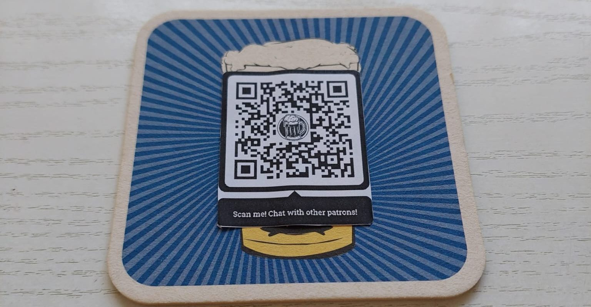
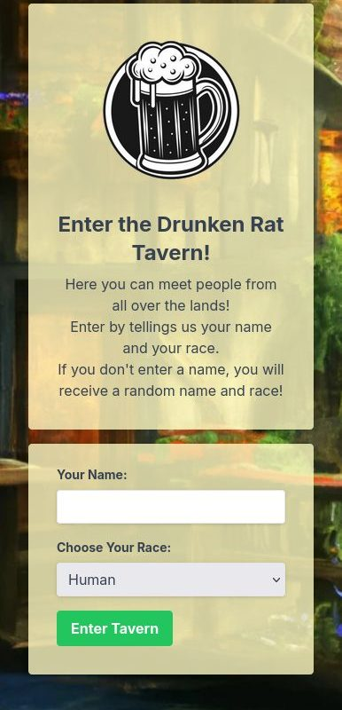
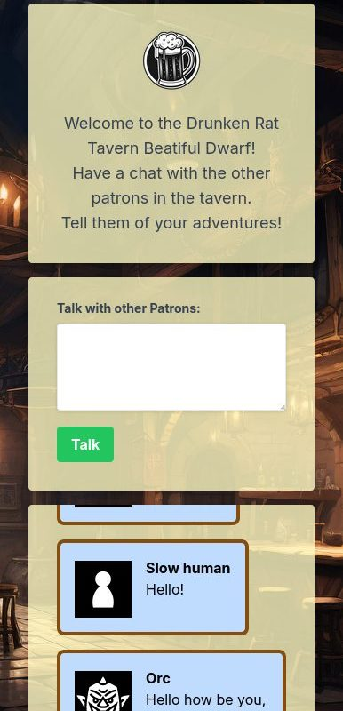
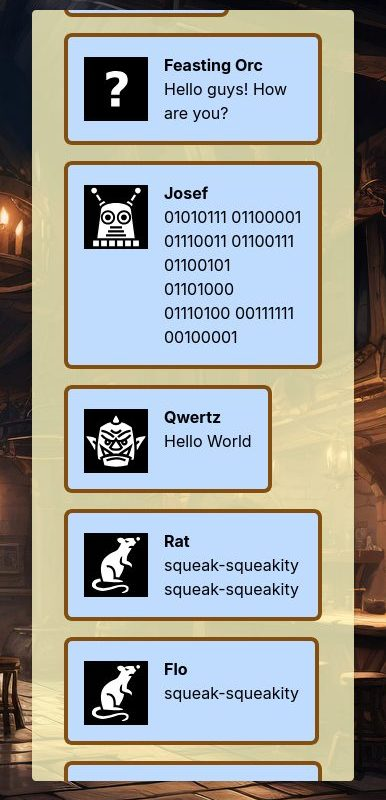

## Project idea

The project idea came from combining my technical knowledge of how to create a chat app with my love of fantasy. I already had a general understanding of how to build a chat app thanks to previous assignments, which made it a good fit for the scope of the project. At the same time, I wanted to create a project based on fantasy. This resulted in a combination of both—The Drunken Rate Tavern. It is a chat app where you can choose your name and a fantasy race before you start chatting. These races consist of various fantasy races, such as dwarves or orcs. The race then influences the messages that are sent by replacing some words, making the message sound like it was written by that race. For example, in the case of orcs, “Boys” becomes “Boyz” or ‘Humans’ becomes “'Umiez.”

My plan was then to use a real beer mug or coaster as the physical medium. This could be used in a real restaurant, for example. Guests could use it to communicate with other guests in a fun way while waiting for their food.

## Implementation

I used simple HTML, CSS, JavaScript, and PHP for the implementation. I also used JQuery for the JavaScript and Tailwind for the CSS. JQuery was used for automatically reloading the messages. I also created a simple MySQL database that stores all sent messages. I focused primarily on the backend and the functions and kept the frontend rather simple. The project was hosted via the Campus Cloud and its PHP instance.

|  |  |  |
| ------------------------------------ | ----------------------------------- - | ------------------------------------ |

Link to the website (no longer functional): https://it241501-20437.php.fhstp.cc/tavern/

All images are my own.