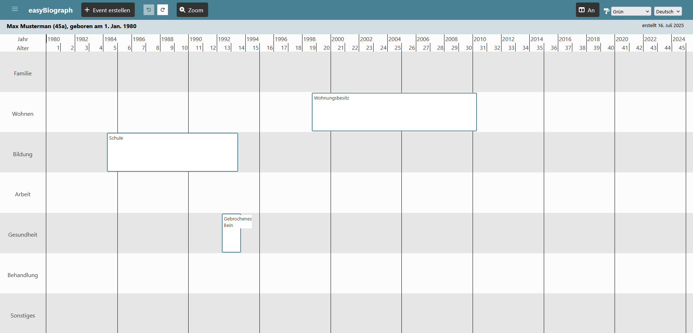

## Introduction

easyBiograph is an FH project that was originally created and funded by the EU Erasmus+ program. With the help of easyBiograph, you can record a person's family, residential, educational, work, health, and support biographies along a timeline and then analyze them.

I worked on this project during the FH course “Tun-Forsche-Gründen” (Do-Research-Found). The aim of the course was for other students or research projects to advertise a work package of approx. 80 hours, and then to apply for one of these. I applied for the “easyBiograph” research project. Dipl.-Ing. Mag. Alexander Rind then gave me various work packages to choose from, both in easyBiograph and in the easyNWK project, another project for which he had advertised work packages.

I decided to implement an undo function. The aim of the function was to allow users to undo the individual steps they took when using the biographer, but also to restore them at the same time. The use of the function should also correspond to a person's normal expectations, for example, as one is accustomed to in Microsoft Word.

## Implementation

The easyBiograph already had comprehensive functions when I joined this project and started working on it. You can create a biography for a person and enter events on various event axes, which you can also create yourself. You can also zoom in and adjust various settings. For example, you can change the color scheme of the interface or switch between German and English. The biography can also be printed out.

easyBiograph is written in Vue.js, and the undo history specifically uses the so-called Vuex Store. This is a Vue.js library for state management. I didn't have to develop an undo and redo system from scratch, as there was already one in the easyNWK research project that I could use as a guide. There was also already a basic system for the undo history in easyBiograph, which was based on these repositories (https://github.com/anthonygore/vuex-undo-redo and https://easynwk.fhstp.ac.at/). Basically, every state change (e.g., a new event, changes to settings, etc.) is executed as a translation and stored as a list so that the action can be undone or restored using this list. 

I once looked into connecting the basic system to the rest of the biographer and seeing how well it already works. New buttons for undo and restore were added and the undo system was connected to them. This allowed simple actions, such as event creation, to be undone. However, I noticed several problems.

For example, settings such as language or color scheme were not saved correctly, which meant that they were not recognized by Vuex. There was also a bigger problem: some actions, such as zooming in on the biographies or changing the biography settings (person details, biography axes), require the biographies to be reloaded. However, this causes the transaction list to be deleted and means that the undo history is no longer accessible. 

I had to come up with a solution that would allow me to still have the transaction list after reloading the browser. I used localStorage, a browser feature that allows values to be saved and still be accessible after reloading. 

Once one of these actions was performed, I saved the transaction list in localStorage and retrieved it immediately after loading so that all transactions were retained. However, this only happens with these specific setting changes and not when you leave the page normally, as the normal expectation is that the undo history will be retained as long as you are working.

Once I had finished and tested everything, I created a merge request in the repository so that Dipl.-Ing. Mag. Alexander Rind could also view and review my changes. After I made a few more changes he requested, he was very satisfied with my changes and approved them.

## Conclusion

It is always a challenge to join an existing project and make changes to it. But it is also always a great feeling to slowly but surely understand the project and develop it further. I am very happy that I was able to contribute to the development of easyBiograph and that my work was very satisfying.

## Links

- easyBiograph GitHub-Repository: [https://github.com/fhstp/easybiograph](https://github.com/fhstp/easybiograph)
- easyBiograph information page: [https://easybiograph.fhstp.ac.at/](https://easybiograph.fhstp.ac.at/)
- easyNWK GitHub-Repository: [https://github.com/fhstp/easynwk-web](https://github.com/fhstp/easynwk-web)
- easyNWK information page: [https://easynwk.fhstp.ac.at/](https://easynwk.fhstp.ac.at/)
- Vue.js: [https://vuejs.org/](https://vuejs.org/)
- Vuex: [https://vuex.vuejs.org/](https://vuex.vuejs.org/)
- Inspiration repository: [https://github.com/factorial-io/undo-redo-vuex](https://github.com/factorial-io/undo-redo-vuex)
- Inspiration repository: [https://github.com/anthonygore/vuex-undo-redo](https://github.com/anthonygore/vuex-undo-redo)