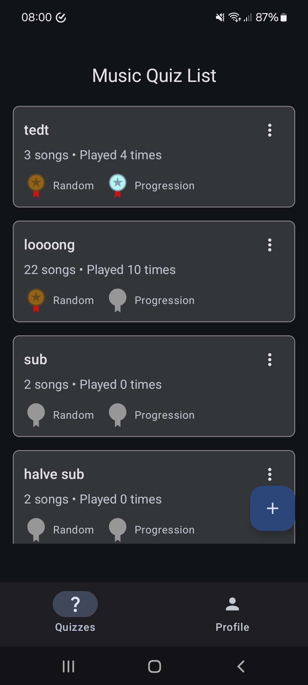
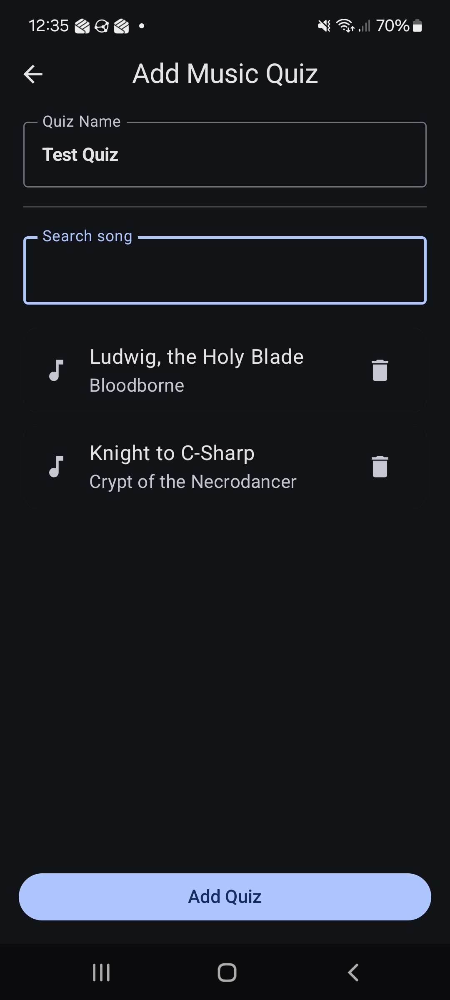
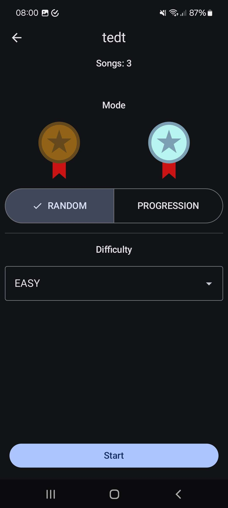
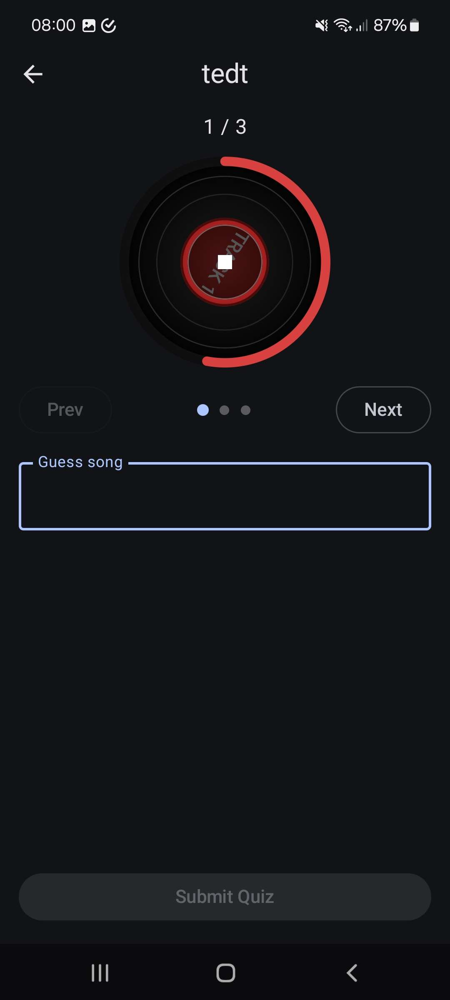
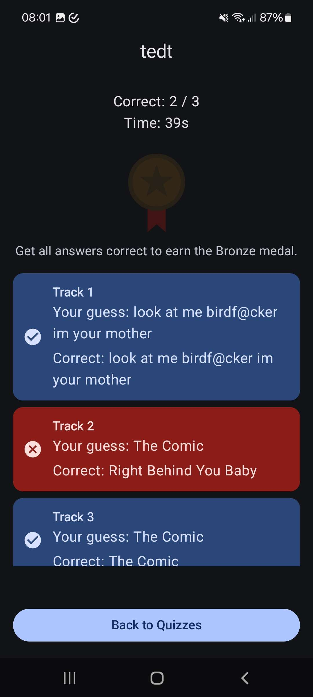

Im dritten Semester ist es uns frei in der Mobile Masterklasse überlassen, wie wir neben dem Semesterprojekt auf unsere Punkte kommen wollen. Um auf die Punkte zu kommen, habe ich in diesem Semester, ein eigenes Kotlin Projekt gemacht. Diese ist ein MusicGuesser. Man kann aus lokalen MP3s Quizzen erstellen und dann in einem Quiz den Liedtitel aus einem kurzen Snippet des Liedes erraten 

## Features

### Quiz erstellen

Beim Start der App kann man einen Order mit lokaler Musik aussuchen. Danach landet man am Hauptscreen. Mithilfe des FloatinACtionButtons kann man ein neues Quiz erstellen. Diesem kann man einen Namen geben und per ausgewählter Suchbegriffe die Liedtitel aussuchen und dem Quiz hinzufügen. Danach kann man das Quiz in der Liste sehen, mit Information wie dem Namen, der Anzahl der Lieder und welchen Rang man in welchem Modus hat.

|  |  |
| ------------------------------------------------ | ------------------------------------------------ |

### Quiz starten

Wenn man auf ein Quiz drückt, dann kommt man auf den Start Screen des Quiz. Dort kann man den Modus auswählen, Random und Progression, zusammen mit der Schwierigkeit. Der Mode entscheidet, wie man die Lieder navigieren kann. Auf Random, kann man zwischen jedem Lied hin und her springen. Bei Progression, muss man das derzeitige Lied erraten bevor man weitergehen kann. Die Schwierigkeit gibt an, wie lange der Ausschnitt des Liedes ist, und mit höherer Schwierigkeit wird der Ausschnitt kürzer.

|  |
|:-------------------------------------------------------:|

### Quiz spielen

Beim Spielen hat man oben einmal den Player, mithilfe wessen man den Ausschnitt abspielen kann. Darunter hat man die Navigation, köpfe fürs vorwärts und rückwärts springen und im Random Gamemode auch Dot Indikators, auf welchem Lied man sich befindet und mithilfe dessen man auch navigieren kann. Wenn man fertig mit einem Lied ist, kommt man auf den result screen. Dort bekommt man eine Medaille, wenn man alle Lieder richtig hatte. Wenn man das Lied auf einer höheren Schwierigkeit schafft, dann bekommt man auch eine bessere Medaille. Zuletzt hat man auch eine Ansicht, was man bei welchem Lied geraten hat und ob es richtig war.

|  |  |
| ------------------------------------------------ | ------------------------------------------------ |

## Technologien

Die App wurde als eine native Android-App mithilfe von Kotlin entwickelt. Als UI Tool Kit wurde Jetpack compose verwendet. Manche der anderen verwendetetn Libnries wären:
- Room: Eine Persistenz Library, welche über einen Abstraktionen-Layer wie Entity und DAO Klassen mit einer SQLite Datenbank interagiert und managen.
- Media3 ExoPlayer: Einer der Basis Mediaplayer auf Android und von Jetpack Compose. Erlaubt die Basisfunktionalitäten, wie abspielen, pausieren, etc.
Weiter kleiner Libraries welcher verwendet wurde, sind zum Beispiel Koin für die Dependency injection oder Compose Navigation.

## Herausforderungen

Die wahrscheinlich größte Herausforderung war die generelle Verwendung von Kotlin. Im zweiten Semester hatten wir zwar eine Einführung in Kotlin und auch für unser Semesterprojekt im dritten Semester haben wir Kotlin verwendeten. Aber eine ganze App alleine zu entwickeln war noch einmal etwas anderes und eine größere Herausforderung.

Eine andere Herausforderung war das Installieren der Libraries. Oft stand auf den Dokumentationsseiten nicht alle nötigen dependincies zum Installieren, oder sie waren über verschiedene Seiten aufgeteilt/stand etwas anderes. Auch standen sie oft noch in der alten Form auf den Seiten, wo die Versionen direkt im build gradle eingetragen wurde. Jetzt gibt es die neuere Version, die Version `libs.versions.otml` einzutragen und das dependency definieren im `build.gradle.kts` zu machen. Wenn man aber die generelle Struktur weiß, war dies ein geringeres Problem.

Ein anderes Problem war die Größe meiner Musik Bibliothek. Ich habe über 1000 lokale Lieder, welche die Optimierung des Durchsuchens wichtig gemacht hat. Nach etwas herumprobieren habe ich den MediaStore, welche automatisch einen Index aller Media Dateien am Handy besitzt, und der Zugriff und Abruf meiner Bibliothek in Sekunden vollziehen konnte

## Learnings und Nächste Schritte

Ich habe einiges über die generelle Verwendung und Entwicklung mit Kotlin gelernt. Auch das von einer meiner Kollegen beigebrachte MVC Prinzips, anhand eines BaseViewModels mit Action, State und Effekt Klassen. 

Es gibt einige Richtungen, wie dieses Projekt erweitert werden könnte, viele Ideen, welche von meinem Kollegen beim Herzeigen kamen. Zum Beispiel das Erstellen von Online quizzen, welche von anderen Personen gesehen werden könnten. Auch neue Spielmodi, wie das Hören von Song in reverse oder einen endlosen Modus kamen.
