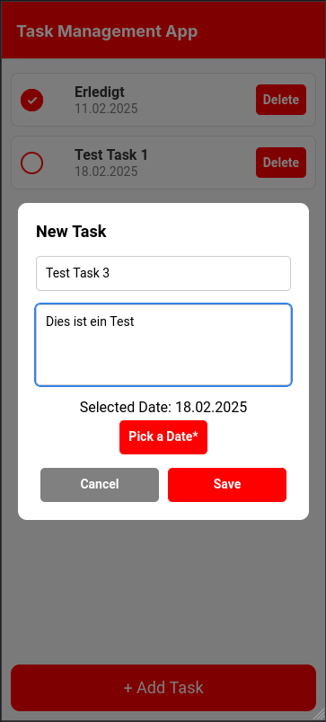
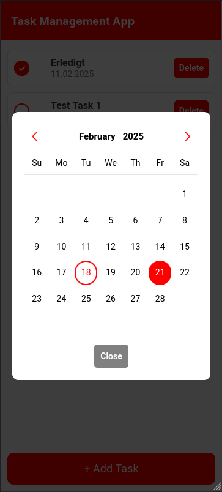
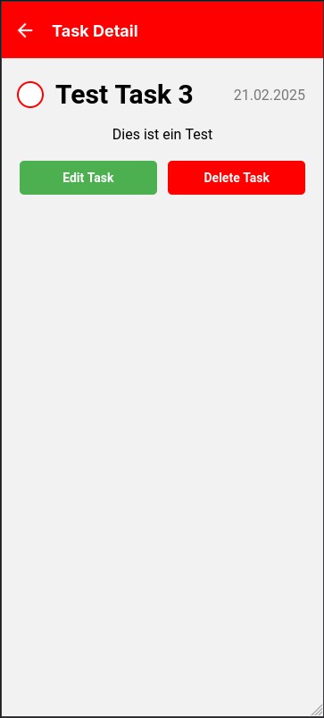
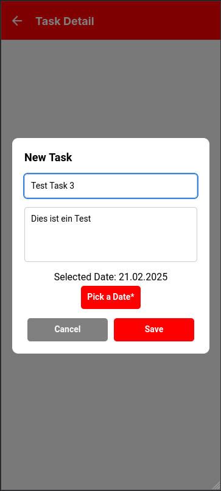

For extra points, I also wrote a digital household budget book in Ionic with a NestJs backend alongside my main project. The main goal here was to learn how to use React Native, as I had never used it before. To learn how to use it, I created a simple task list app where you can create, edit, and delete tasks, and everything is stored in local storage.

## Features

Since the purpose of this project was more to learn React Native, the app's features are kept very simple. There is a main window where you can see all the tasks that have been created. They are sorted by date and display important information about the task, such as when it is due, the title of the task, and whether it has already been completed or not. 

The list also allows you to mark the task as completed or undo this, and also to delete the task.

|  |  |  |
| ------------------------------------ | ------------------------------------ | ------------------------------------ |

The main window also features a floating button that allows you to add new tasks. You can enter the title, an optional description, and the due date of the task. 

|  |  |
| ------------------------------------ | ------------------------------------ |

You can also click on a task in the list to go to a details page where you can view all the information about the task, including the description. As in the list, you can also check the checkbox here, and there are two buttons, one for deleting and one for editing the task, where you can change all the information.

|  |  |
| ------------------------------------ | ------------------------------------ |

## Technologies

I used React Native together with the Expo framework as technologies for the task app. This was also the main reason behind the project to learn React Native, as we had only learned Ionic in conjunction with Angular so far. I used various things, such as the Expo Router or React components, to create the app. All data was stored locally using the AsyncStorage library. Two external components were also used, one for a date picker and one for the checkboxes.

## Challenges

Probably the biggest challenge was really learning React Native. React in general has a very different structure compared to Ionic and Angular. For one thing, you mostly work in one file, and you use hooks such as useState for variable declaration and useEffect to load changes, for example when initializing the page. Also, you normally work a lot with components, i.e., you divide the program into many parts so that you can reuse them often.
 
React Native itself is also somewhat limited. For example, to use a date picker or a checkbox, you have to install extra libraries. The same applies to navigation, which was also a bit more complicated because you have to distinguish between the React Navigation Library and the Expo Router.

## Lessons learned and next steps

I am very happy to have done this project, as I feel I have gained a greater understanding of React Native and React in general. I learned how to build a native app for Android, iOS, and the web using React Native and Expo, as well as how the basic concepts of React work.

The next steps would definitely be to delve deeper into React Native. On the one hand, I could continue this project and try to expand it, for example with my own backend or functions such as filters. I could also start a new project to explore other aspects of React Native. I could also look at another framework or Vanilla React Native to see the differences.
