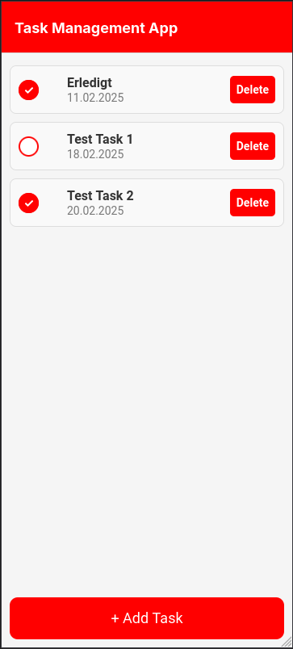
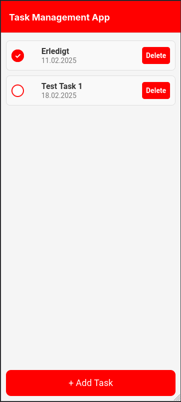

Für extra Punkte habe ich auch neben meinem Hauptprojekt, ein digitales Haushaltsbuch, geschrieben in Ionic mit einem NestJs Backend. Hierbei war das Hauptziel, die Verwendung von React Native zu erlernen, da ich es zuvor nie verwendet habe. Zum Erlernen habe ich hierzu eine einfache Tasklisten App erstellte, in welcher man Tasks erstellen, editieren und löschen kann und alles im lokalen Storage gespeichert ist.

## Features

Nachdem der Sinn dieses Projektes mehr das Lernen von React Native war, sind die Funktionen der App sehr einfach gehalten. Es gibt ein Hauptfenster, in welche man alle Tasks welche angelegt sind, sehen kann. Sie sind nach Datum geordnete und gebe die wichtigen Informationen über den Task wieder. Bis wann er zu erledigen ist, der Titel des Tasks und ob er schon erledigt ist oder nicht. 

Die Liste gibt auch die Möglichkeit, den Task als erledigt zu markieren oder dies auch rückgängig zu machen und auch den Task zu löschen.

|  |  |  |
| ------------------------------------ | ------------------------------------ | ------------------------------------ |

|  |  |  |
| ------------------------------------ | ------------------------------------ | ------------------------------------ |

Im Hauptfenster gibt es auch einen Floating-Button, welcher das Hinzufügen von neuen Tasks erlaubt. Man kann den Titel eingeben, eine optionale Beschreibung, wie auch das Fälligkeitsdatum des Tasks. 

| ![[Pasted image 20250218141718.png]] | ![[Pasted image 20250218141738.png]] |
| ------------------------------------ | ------------------------------------ |

Auch kann man auf einen Task in der Liste drücken, und man kommt auf eine Detailseite, wo man alle Informationen des Tasks, wie auch die Beschreibung einsehen kann. Wie auch in der Liste, kann man auch hier die Checkbox bestätigen und es gibt zwei Knöpfe, einen zum Löschen und einem zum Editieren des Tasks wo man alle Information Ändern kann.

| ![[Pasted image 20250218141813.png]] | ![[Pasted image 20250218141833.png]] |
| ------------------------------------ | ------------------------------------ |

## Technologien

Als Technologies für die Taskapp habe ich React Native, zusammen mit dem Framework Expo verwendet. Dies war auch er Hauptgrund hinter dem Projekt um React Native zu lernen, da wir bisher nur Ionic in Verbindung mit Angular gelernt hatten. Ich habe verschiedene Sachen, wie den Expo Router oder React Komponenten verwendet, um die App zu erstellen. Alle Daten wurden lokal durch die library AsyncStorage gespeichert. Auch wurden zwei externe Komponenten verwendet, eine für einen Datepicker und einen für die Checkboxen.
## Herausforderungen

Die wahrscheinlich größte Herausforderung war das echte lernen von React Native, React generell hat einen sehr unterschiedlichen Aufbau im Gegensatz zu Ionic und Angular. Zum einen das man größtenteils in einer Datei arbeitete, wie auch die Verwendung von hooks, wie useState, für die Variablen Deklaration, useEffect, um Änderungen zum Beispiel Änderungen beim Initialisieren der Seite zu laden. Auch dass man im Normalfall viel mit Komponente arbeitet, also das Programm in viele Teile aufteilt, um sie oft wiederverwende zu können.
 
Auch das React Native an sich etwas limitiert ist. Zum Beispiel, um einen Datepicker oder eine Checkbox zu verwenden, müssen extra Libraries installiert werden. Das Gleiche gilt auch für die Navigation, welche auch etwas komplizierter war, da man zwischen der React Navigation Library und den dem Expo Router zu unterscheiden.
## Learnings und Nächsten Schritte

Ich bin sehr froh dieses Projekt gemacht zu haben, da ich vom Gefühl her ein größeres Verständnis von React Native und auch React generell erlangen konnte. Ich habe gelernt wie man Per React Native und Expo eine Native App für Android, IOS und Web bauen kann und auch wie die Grundlenden Konzepte von React funktionieren.

Nächste Schritte wären auf jeden Fall eine Vertiefung in React Native. Zum einen könnte ich dieses Projekt weiterführen und versuchen auszubauen, zum Beispiel mit einem eigenen Backend oder Funktionen, wie Filtern. Auch könnte ein neues Projekt begonnen werden, um sich andere Seiten React Native anzeigen. Ich könnte mir auch ein anderes Framework oder Vanilla React Native anschauen, um die Unterschiede zu sehen.
