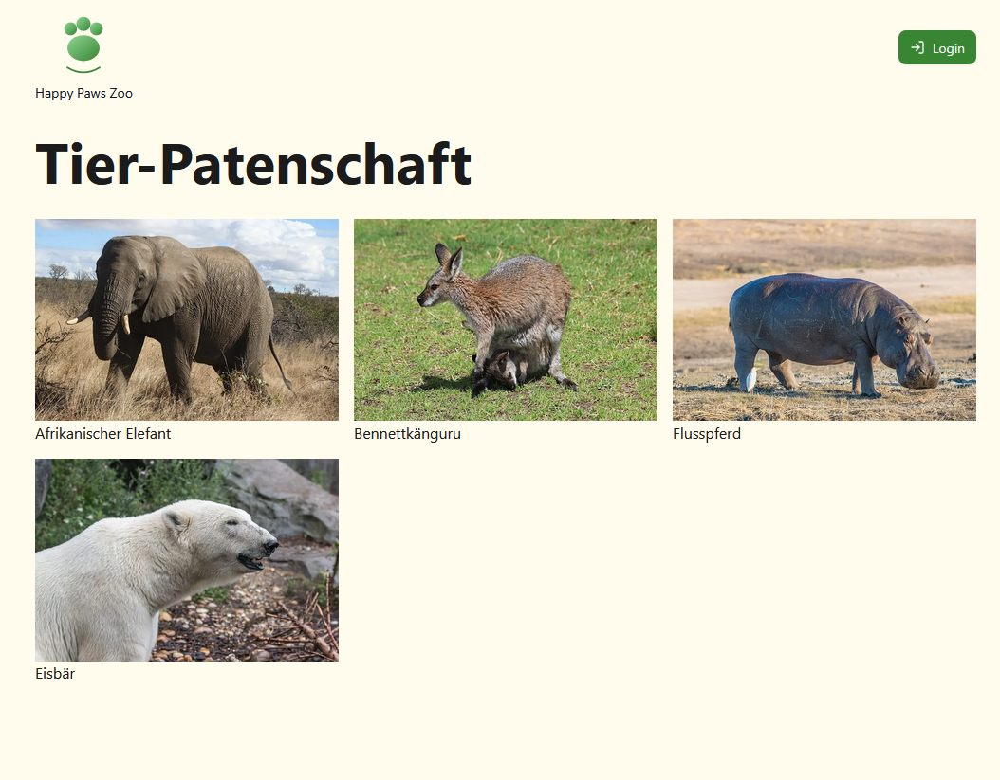
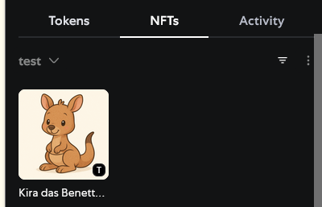

## Einleitung

Ziel des Projektes war es, den Adoptionsprozess eines Zoos über die Blockchain abzubilden. Hiermit sollten BesucherInnen leicht PatIn eines Tieres werden können, und deren Patenschaft würde auf der Blockchain gespeichert werden, wodurch dieses Zertifikat unveränderlich und permanent für alle sichtbar wäre. Das Projekt wurde innerhalb der 2025 Summer School an der FH St. Pölten innerhalb des Workshops "Smart Contracts: Token creation with ERC20" ([https://creativemediasummer.fhstp.ac.at/workshops/smart-contracts-token-creation-with-erc20](https://creativemediasummer.fhstp.ac.at/workshops/smart-contracts-token-creation-with-erc20)) erstellt. Nachdem wir über die Blockchain und Smart Contracts gelernt haben, konnten wir uns selbst ein eigenes Projekt für die Woche aussuchen und innerhalb der verbleibenden eineinhalb Tage entwickeln.

Der Workshop ging vom 23.06.2025 bis zum 27.06.2025, und dieses Projekt wurde in einer Gruppe von drei Personen, Jan Weiß, Vilmos Nagy und mir, Sebastian Zettl, erstellt. Zusammen haben wir uns verschiedene Ideen ausgedacht, bis wir bei der Tierpatenschaft gelandet sind. Wir mochten die Idee, und es hat sich nach einem guten Umfang für die vorgegebene Zeit des Projektes angefühlt.

Eine grundsätzliche Erklärung der wichtigsten Begriffe:

Die Blockchain ist eine dezentrale Datenbank, welche chronologisch daten speichert. Da sie dezentral ist, gibt es keinen zentralen Server, sondern es wird über mehrere "nodes" alles gespeichert. Ein Smart Contract ist ein programmierter Vertrag auf der Blockchain. Er führt bestimmte Abläufe aus, wenn die passenden Bedingungen erfüllt sind. Token sind digitales Vermögen, welche auf der Blockchain gespeichert sind. Es gibt hier verschiedene Standards, wie ein Token aussehen kann. Für uns relevant ist der ERC-1155 Stand, welcher es ermöglicht, mehrere Token des gleichen Types zu verkaufen. Hierdurch können mehre Personen die Paten des gleichen Tieres werden.

Dieser kombiniert auch ERC-20 und ERC-712. ERC-20 ist der Standard für austauschbare Token, welche man am ehesten mit normalen Währungen vergleichen kann. ERC-721 steht stattdessen für nicht austauschbare Token, welche einzigartig sind, welche zum Beispiel für Sachen wie Bilder oder Ticket verwendet werden können. Sie werden auch NFT (Non-Fungible Token) genannt.
## Vorgehensweise / Umsetzung

Für das Projekt wurde einer Vielfalt an Technologien verwendet.

Am wichtigsten ist wahrscheinlich die Sprache Solidity. Dies ist eine High-Level und objektorientierte Programmiersprache, welche speziell für die Entwicklung von Smart Contracts entwickelt wurde. Unsere Tierpatenschaften Smart Contract wurde zusätzlich in Remix IDE entwickelt, eine spezielle IDE, welche auf Smart Contracts abgestimmt ist. Remix erlaubt das einfache Testen in EVM (Etherum Virtual Environments) von den entwickelten Contracts, bevor man sie in der echten Blockchain deployed.

Ich habe teilweise beim Entwickeln und Erlernen des Smart Contracts mitgewirkt. Ein Großteil des Contracts wurde aber von Vilmos Nagy entwickelt. Auch haben wir OpenZeppelin verwendet. Dies ist ein Open-Source-Framework. Dieses stellt zum Beispiel schon standardisierte Contracts für ERC-20 oder ERC-1155 bereit, sodass man selbst das Rad nicht neu erfinden muss.

Grundsätzliche Funktionen beinhalten, dass der/die InhaberIn des Contracts, in diesem Fall der Zoo selbst, der einzige ist, welcher Token erstellen kann. Gäste, also andere UserInnen, können dann einen der vom Zoo bereitgestellten Token kaufen, um auf diese Weise das Tier zu adoptieren, wodurch der Token auch in der Kryptowallet des Gastes landet. Auch können die InhaberInnen des Token das Tier wieder zurückgegeben. Zusätzlich gibt es die Standardfunktionen, welche ein ERC-1155 Token beinhalten muss, wie zum Beispiel `balanceOf(address account, uint256 id)`, welcher die Anzahl an Token im Besitz der Adresse zurückgibt.

Weiter wurde auch das IPFS (InterPlanatary Filesystem) verwendet. Dies ist ein dezentraler Ort um Dateien, wie zum Beispiel Bilder oder Dateien wie JSONs, abzulegen. Wir haben hierfür Pinata verwendet, einen IPFS Storage Anbieter. In Pinata haben wir die Bilder für die Tier NFTS plus JSONs mit ein paar Informationen zu den Tieren abgelegt. Wenn eine Person ein Tier adoptiert, dann landet ein NFT davon in ihrer Wallet und das Bild, plus die Informationen im JSON, werden von Pinata geholt, und in der Kryptowallet des/der PatIn  angezeigt.

### Backend

Damit wir den Smart Contract dann auch in Verbindung mit dem Frontend verwenden können, mussten wir ihn irgendwo hin deployen. Nachdem wir es in dem lokalen EVM getestet haben, gab es zwei Möglichkeiten: über eine Kryptowallet, zum Beispiel MetaMask, kann man einen Smart Contract in ein Testnetz hochladen, um es dort testen zu können. In unserem Fall wäre diese Testnetz Sepolia gewesen.

Wir haben uns aber für die zweite Möglichkeit entschieden, es in einer lokalen Blockchain zu deployen. Dafür habe ich mir die Möglichkeiten angeschaut und mich für Hardhat entschieden. Mit Hardhat kann man eine lokale Blockchain starten, auf welche man Smart Contracts deployen kann.

Dies habe ich mir angeschaut und mich eingelesen. Ich habe Hardhat einmal installiert und den Smart Contract abgelegt. Mit Hardhat gab es keine Probleme, den Contract einmal zu kompilieren, um den ABI (Application Binary Interface) zu bekommen, damit externe Applikationen damit interagieren können. Danach habe ich auch mit Hilfe von viem, eine TypeScript/JavaScript-Bibliothek fürs Interagieren mit der Blockchain, eine Deployment Script geschrieben. Dieses Script, zum einen, stellt den Contract auf die lokale Blockchain, holt die Adresse, auf der der Contract liegt und schreibt diese in eine JSON Datei, welche vom Frontend eingelesen wird, damit es Befehle an diese Adresse schicken kann.
### Frontend

Das Entwickeln des Smart Contracts war zwar einer der wichtigsten Teile, aber wir wollten auch zusätzlich ein kleines Frontend entwickeln, um die Funktionen besser darstellen zu können. Hierfür haben wir mit Next.js, einem React.js Framework, ein einfaches Frontend erstellt. Hierfür hatte Jan Weiß einmal das grundsätzliche Aussehen entwickelt, während der Smart Contract entwickelt wurde. Beim Aussehen der Website habe ich mitgeholfen, aber ein Großteil hier wurden von Jan Weiß gemacht. Der Großteil meiner Arbeit im Frontend hat die Verbindung mit einer Kryptowallet und dem Contract beinhaltet.

Für die Verbindung habe ich Wagmi.js verwendet. Es ist eine React Hook Library, um einfacher mit der Blockchain zu kommunizieren. Es erlaubt, leichter Verbindung zu einer Kryptowallet aufzunehmen und bietet verschiedene Hooks an, welche im Hintergrund viem verwendet, um mit dem deplyoten Contract zu interagieren.

Die grundsätzlichen Funktionen unseres Frontends inkludieren eine Hauptseite aller Tiere plus Detailseiten für jede Tierart. Auf der Hauptseite kann man sehr gut alle Tiere aufgelistet sehen. Im Header ist zum einen das Logo des Zoos "Happy Paws Zoo" zu finden, wie auch eine Loginbutton, über den man eine Kryptowallet verbinden kann.

Sobald man auf ein Tier klickt kommt man auf eine Detailseite mit verschiedenen Information zu diesem Tier, so wie man es auch in einem echten Tiergarten vorfinden würde. Weiter unten in der Beschreibung gibt es dann die Möglichkeit, Pate der verschiedenen Tiere zu werden.

Es werden konkrete Tiere in einer von mir erstellten Cardview angezeigt, zusammen mit den Informationen, wie viele Patenschaften noch offen sind, und ob man das Tier schon adoptiert hat, oder es noch frei ist und adoptiert werden kann.

Wenn man ein Tier adoptieren will, muss man zuerst eine Kryptowallet verbinden, danach kann man über den Adoptieren-Button eine Transaktion über die Kryptowallet bestätigen. Nach einer kurzen Wartezeit sieht man dann, dass das Tier adoptiert wurde und wenn man in die Wallet hineinschaut, dann sieht man ein NFT des adoptieren Tieres zusammen mit einer kleinen Beschreibung und einem Bild.

## Persönliche Erfahrungen und Fazit

Der Workshop war ein sehr interessantes Erlebnis für mich. Vor dem Workshop hatte ich nicht wirklich eine Ahnung von der Blockchain, außer den Informationen, welchen man hie und da im Internet liest. Also war der Workshop eine großartige Möglichkeit, zumindest einmal mehr über diese Technologie zu erfahren. Ich habe ein besseres Verständnis gewonnen plus auch die Erfahrung, dass ich mich zurzeit nicht viel mehr mit dieser Technologie befassen will. Meiner Meinung nach gibt es zurzeit noch mehr Probleme, wie folgendes, dass es einen hohen Stromkonsum mit sich bringt, und der Gewinn einer permanenten, chronologisch geordneten und immer erreichbaren Datenbank diesen zurzeit noch nicht übersteigt.

Die wahrscheinlich größte Herausforderung war, dieses ganze Projekt innerhalb nicht einmal eineinhalb Tagen auf die Beine zu stellen. Es war eine Herausforderung, vor allem wenn man davor noch nicht wirklich viel Erfahrung mit der Blockchain hatte.

Wir als Team haben dies aber unsere Meinung nach gut geschafft und sind alle wirklich stolz auf unser Ergebnis.

Zusammenfassend bin ich wirklich froh, diesen Workshop gemacht zu haben.
## Links und Quellen

- GitHub-Repository: [https://github.com/realJanWeiss/zoo-sponsorship](https://github.com/realJanWeiss/zoo-sponsorship)
- Remix IDE: [https://remix-project.org/?lang=en](https://remix-project.org/?lang=en)
- OpenZeppelin: [https://www.openzeppelin.com/](https://www.openzeppelin.com/)
- Pinata: [https://pinata.cloud/](https://pinata.cloud/)
- Hardhat: [https://hardhat.org/](https://hardhat.org/)
- Viem: [https://viem.sh/](https://viem.sh/)
- Wagmi: [https://wagmi.sh/](https://wagmi.sh/)
- Next.js: [https://nextjs.org/](https://nextjs.org/)
